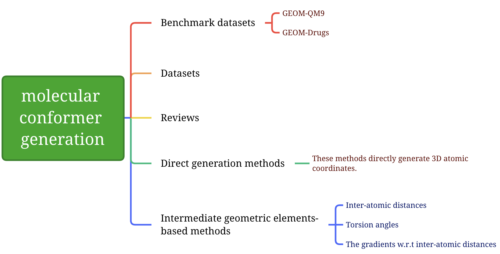

# Benchmark datasets

The benchmark datasets in molecular conformation generation task are **GEOM-QM9** and **GEOM-Drugs**.

The detail information of the benchmark is referred from "Zhu J ,  Xia Y ,  Liu C , et al. Direct Molecular Conformation Generation[J]. arXiv e-prints, 2022":

|                | GEOM-QM9 | GEOM-Drugs |
| -------------- | -------- | ---------- |
| Training set   | 200K     | 200K       |
| Validation set | 2.5K     | 2.5K       |
| Test set       | 22408    | 14324      |

**large-scale setting**

|                | GEOM-QM9 | GEOM-Drugs |
| -------------- | -------- | ---------- |
| Training set   | 1.37M    | 2M         |
| Validation set | 165K     | 100K       |
| Test set       | 174K     | 100K       |

# Datasets

# Reviews

Progress in Computational Chemistry (*Interdisciplinary Science Letters*, 2018) [[Paper](https://www.hanspub.org/DownLoad/Page_DownLoad.aspx?FileName=ISL20180400000_66541862.pdf)]

# Direct generation methods

[**CoarseGrainingVAE**] Generative Coarse-Graining of Molecular Conformations (*arXiv*, 2022) \[[Paper](https://arxiv.org/abs/2201.12176v1)] [[Code](https://github.com/wwang2/CoarseGrainingVAE)]

[**DMCG**] Direct Molecular Conformation Generation (*arXiv*, 2022) \[[Paper](https://arxiv.org/abs/2202.01356)] [[Code](https://github.com/DirectMolecularConfGen/DMCG)]

[**GEODIFF**] GeoDiff: a Geometric Diffusion Model for Molecular Conformation Generation (*ICLR*, 2022) \[[Paper](https://arxiv.org/abs/2203.02923)] [[Code](https://github.com/MinkaiXu/GeoDiff)]

[**CGVAE**] Generative Coarse-Graining of Molecular Conformations (*ICML*, 2022) \[[Paper](https://arxiv.org/abs/2201.12176)] [[Code](https://github.com/wwang2/CoarseGrainingVAE)]

# Intermediate geometric elements-based methods

Intermediate geometric elements include atomic distances, torsion angles and the gradients w.r.t. (with regard to) inter-atomic distances, etc.

## Inter-atomic distances

[**CGCF-ConfGen**] Learning Neural Generative Dynamics for Molecular Conformation Generation (*ICLR*, 2021) \[[Paper](https://openreview.net/forum?id=pAbm1qfheGk)] [[Code](https://github.com/luost26/CGCF-ConfGen)]

[**GraphDG**] A generative model for molecular distance geometry (*ICML*, 2020) \[[Paper](https://arxiv.org/abs/1909.11459)] [[Code](https://github.com/gncs/graphdg)]

[**GraphAF**] GraphAF: a Flow-based Autoregressive Model for Molecular Graph Generation (*ICLR*, 2020) \[[Paper](https://openreview.net/forum?id=S1esMkHYPr)] [[Code](https://github.com/DeepGraphLearning/GraphAF)]

## Torsion angles

## The gradients w.r.t inter-atomic distances

[**ConfGF**] Learning Gradient Fields for Molecular Conformation Generation (*ICML*, 2021) \[[Paper](https://arxiv.org/abs/2105.03902)] [[Code](https://github.com/DeepGraphLearning/ConfGF)]

[**DGSM**] Predicting Molecular Conformation via Dynamic Graph Score Matching (*NeurIPS*, 2021) \[[Paper](https://openreview.net/forum?id=hMY6nm9lld)] [[Code]()]

