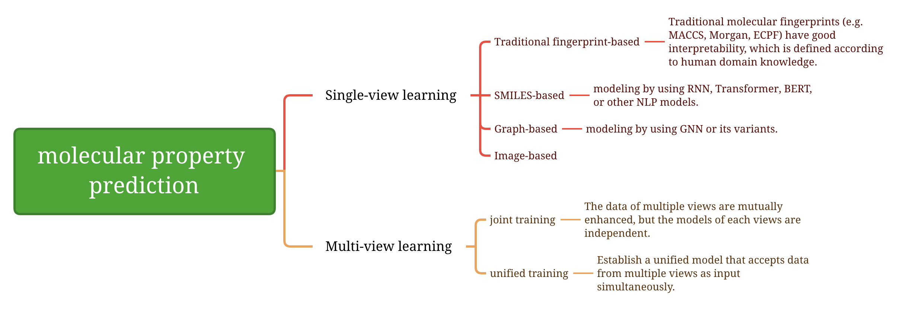

# Benchmark datasets

## Classification task

| Dataset | # Molecules | # Tasks |
| ------- | ----------- | ------- |
| BBBP    | 2039        | 1       |
| Tox21   | 7831        | 12      |
| ClinTox | 1478        | 2       |
| HIV     | 41127       | 1       |
| BACE    | 1513        | 1       |
| SIDER   | 1427        | 27      |
| MUV     | 93087       | 17      |
| ToxCast | 8575        | 617     |

## Regression task

| Dataset       | # Molecules | # Tasks |
| ------------- | ----------- | ------- |
| ESOL          | 1128        | 1       |
| FreeSolv      | 642         | 1       |
| Lipophilicity | 4200        | 1       |
| QM7           | 6830        | 1       |
| QM8           | 21786       | 12      |
| QM9           | 133885      | 8       |

# 1. Datasets

[**OGB-LSC**] OGB-LSC: A Large-Scale Challenge for Machine Learning on Graphs (*arXiv*, 2021) \[[Paper](https://arxiv.org/abs/2103.09430)]\[[Website](https://ogb.stanford.edu/docs/lsc/)]\[[PCQM4Mv2](https://ogb.stanford.edu/docs/lsc/pcqm4mv2/#dataset)]

[**GEOM**] GEOM, energy-annotated molecular conformations for property prediction and molecular generation (*Scientific Data*, 2022) \[[Paper](https://www.nature.com/articles/s41597-022-01288-4)]

[**MoleculeNet**] MoleculeNet: a benchmark for molecular machine learning (*Chemical science*, 2018) \[[Paper](https://pubs.rsc.org/en/content/articlehtml/2018/sc/c7sc02664a)]

# 2. Reviews

Applications of deep learning in molecule generation and molecular property prediction (*Accounts of chemical research*, 2020) \[[Paper](https://pubs.acs.org/doi/full/10.1021/acs.accounts.0c00699?casa_token=He80jSXBH1EAAAAA%3AIS84emvMhUFXx4Q-Klpfi1WxJBWDL_4UvzqnmjeOCSrO9mWxcFRLzdaSZ0Y4iLm3A4IqQFKT1bAyCo7O)]

Deep learning methods for molecular representation and property prediction (*Drug Discovery Today*, 2022) \[[Paper](https://www.sciencedirect.com/science/article/abs/pii/S135964462200366X?via%3Dihub)]

# 3. Single-view learning

## 3.1 Traditional fingerprint-based

[**TF_Robust**] Massively Multitask Networks for Drug Discovery (*arXiv*, 2015) \[[Paper](https://arxiv.org/abs/1502.02072)]

## 3.2 SMILES-based

[**X-MOL**] X-MOL: large-scale pre-training for molecular understanding and diverse molecular analysis (*Science Bulletin*, 2022) \[[Paper](https://www.sciencedirect.com/science/article/pii/S2095927322000445)] \[[Code](https://github.com/bm2-lab/X-MOL)\]

[**ChemBERTa**] ChemBERTa: Large-Scale Self-Supervised Pretraining for Molecular Property Prediction (*NeurIPS* 2020 workshop) \[[Paper](https://arxiv.org/abs/2010.09885)] \[[Code](https://github.com/HyunSeobKim/CHEM-BERT)\]

[**AGBT**] Algebraic graph-assisted bidirectional transformers for molecular property prediction (*Nature Communications* 2021) \[[Paper](https://proceedings.neurips.cc/paper/2020/hash/94aef38441efa3380a3bed3faf1f9d5d-Abstract.html)] \[[Code](https://github.com/ChenDdon/AGBTcode)\]

[**SMILES Transformer**] SMILES Transformer: Pre-trained Molecular Fingerprint for Low Data Drug Discovery (*arXiv* 2019) \[[Paper](https://arxiv.org/abs/1911.04738)] \[[Code](https://github.com/DSPsleeporg/smiles-transformer)\]

## 3.3 Graph-based

[**MolCLR**] Molecular Contrastive Learning of Representations via Graph Neural Networks (*Nature Machine Intelligence*, 2022) [[Paper](https://www.nature.com/articles/s42256-022-00447-x)]\[[Code](https://github.com/yuyangw/MolCLR)]

[**GEM**] Geometry-enhanced molecular representation learning for property prediction (*Nature Machine Intelligence*, 2022) [[Paper](https://www.nature.com/articles/s42256-021-00438-4)]\[[Code](https://github.com/PaddlePaddle/PaddleHelix/tree/dev/apps/pretrained_compound/ChemRL/GEM)]

[**3D Infomax**] 3D Infomax improves GNNs for Molecular Property Prediction (*ICML* 2022) [[Paper](https://proceedings.mlr.press/v162/stark22a.html)]\[[Code](https://github.com/hannesstark/3dinfomax)]

[**GraphMVP**] Pre-training Molecular Graph Representation with 3D Geometry (*ICLR* 2022) \[[Paper](https://openreview.net/forum?id=xQUe1pOKPam)] \[[Code](https://github.com/chao1224/GraphMVP)\]

[**Graphormer**] Do Transformers Really Perform Badly for Graph Representation? (*NeurIPS* 2021) \[[Paper](https://proceedings.neurips.cc/paper/2021/hash/f1c1592588411002af340cbaedd6fc33-Abstract.html)] \[[Code](https://github.com/microsoft/Graphormer)\]

[**MGSSL**] Motif-based Graph Self-Supervised Learning for Molecular Property Prediction (*NeurIPS* 2021) \[[Paper](https://proceedings.neurips.cc/paper/2021/hash/85267d349a5e647ff0a9edcb5ffd1e02-Abstract.html)] \[[Code](https://github.com/zaixizhang/MGSSL)\]

[**MG-BERT**] MG-BERT: leveraging unsupervised atomic representation learning for molecular property prediction (*Briefings in Bioinformatics* 2021) \[[Paper](https://academic.oup.com/bib/article/22/6/bbab152/6265201)] \[[Code](https://github.com/zhang-xuan1314/Molecular-graph-BERT)\]

[**GROVER**] Self-Supervised Graph Transformer on Large-Scale Molecular Data (*NeurIPS* 2020) \[[Paper](https://proceedings.neurips.cc/paper/2020/hash/94aef38441efa3380a3bed3faf1f9d5d-Abstract.html)] \[[Code](https://github.com/tencent-ailab/grover)\]

[**ATMOL**] Attention-wise masked graph contrastive learning for predicting molecular property (*BIB* 2022) \[[Paper] (https://arxiv.org/pdf/2206.08262)] \[[Code](https://github.com/moen-hyb/ATMOL)\] \[[Chinese blog] (https://blog.csdn.net/qq_45331246/article/details/127182918?spm=1001.2014.3001.5501)]

[**ATMOL**] Attention-wise masked graph contrastive learning for predicting molecular property (*BIB* 2022) \[[Paper](https://arxiv.org/pdf/2206.08262)] \[[Code](https://github.com/moen-hyb/ATMOL)\] \[[Chinese blog](https://blog.csdn.net/qq_45331246/article/details/127182918?spm=1001.2014.3001.5501)]

## 3.4 Image-based

# 4. Multi-view learning

## 4.1 joint training

[**DMP**] Dual-view Molecule Pre-training (*arXiv* 2021) \[[Paper](https://arxiv.org/abs/2106.10234)] \[[Code](https://github.com/microsoft/DVMP)\]

[**MM-Deacon**] Multilingual Molecular Representation Learning via Contrastive Pre-training (*ACL* 2022) \[[Paper](https://arxiv.org/abs/2109.08830)] \[[Chinese blog](https://blog.csdn.net/qq_45331246/article/details/127193173?spm=1001.2014.3001.5501)]

## 4.2 unified training

Unified 2D and 3D Pre-Training of Molecular Representations (*KDD 2022*) \[[Paper](https://arxiv.org/abs/2207.08806)] \[[Code](https://github.com/teslacool/UnifiedMolPretrain)\] \[[Chinese blog](https://zhuanlan.zhihu.com/p/544133918)]

