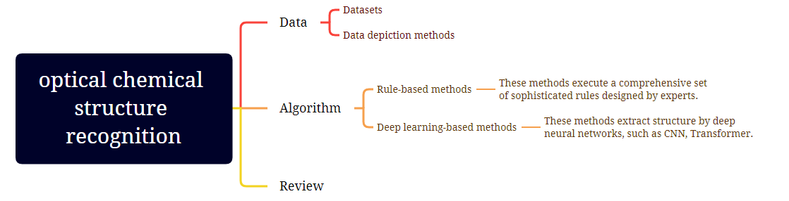

# 1. Datasets

[**CEDe**] CEDe: A collection of expert-curated datasets with atom-level entity annotations for Optical Chemical Structure Recognition (*NeurIPS Workshop* 2022) [[Paper](https://openreview.net/pdf?id=9K-8l0WgSK3)] [[Dataset URL](https://storage.googleapis.com/lgcede/CEDe_dataset_v0.2.tar.gz)]

# 2. Algorithm

## 2.1  Rule-based methods

| Name      | Programming language | Open-Source | Link                                                         |
| --------- | -------------------- | ----------- | ------------------------------------------------------------ |
| CliDE Pro | C++                  | No          | [[Software](http://www.keymodule.co.uk/products/clide/clide-pro.html)] |
| ChemOCR   | Java                 | No          | [[Software](https://www.scai.fraunhofer.de/en/business-research-areas/bioinformatics/products/chemocr.html)] |
| OSRA      | C++                  | Yes         | [[Paper](https://pubs.acs.org/doi/10.1021/ci800067r)] \[[Code](https://github.com/metamolecular/osra)] \[[Web](https://cactus.nci.nih.gov/cgi-bin/osra/index.cgi)] [[Home](https://cactus.nci.nih.gov/osra/)] |
| Imago     | C++                  | Yes         | [[Paper](https://trec.nist.gov/pubs/trec20/papers/GGA.chemical.pdf)] \[[Code](https://github.com/ctrltz/ocsr-project)] \[[Home](https://lifescience.opensource.epam.com/imago/)] |
| MolVec    | Java                 | Yes         | [[Code](https://github.com/ncats/molvec)]        |

## 2.2 Deep learning-based methods

[**MSE-DUDL**] Molecular Structure Extraction from Documents Using Deep Learning (*J. Chem. Inf. Model.* 2019) [[Paper](https://pubs.acs.org/doi/10.1021/acs.jcim.8b00669)] 

---

[**Img2Mol**] Img2Mol - Accurate SMILES Recognition from Molecular Graphical Depictions (*Chem. Sci. 2021) [[Paper](https://pubs.rsc.org/en/content/articlehtml/2021/sc/d1sc01839f)] [[Code](https://github.com/bayer-science-for-a-better-life/Img2Mol)]

----

[**ChemPix**] ChemPix: Automated Recognition of Hand-drawn Hydrocarbon Structures Using Deep Learning (*Chem. Sci.* 2021) [[Paper](https://chemrxiv.org/engage/chemrxiv/article-details/60c755d50f50dbb98f397fad)] [[Code](https://github.com/hayleyweir/im2smiles)]

---

[**ChemGrapher**] ChemGrapher: Optical Graph Recognition of Chemical Compounds by Deep Learning (*J. Chem. Inf. Model.* 2020)  [[Paper](https://pubs.acs.org/doi/10.1021/acs.jcim.0c00459)] [[Code](https://github.com/biolearning-stadius/chemgrapher-self-rich-labeling/)]

[**Oldenhof's model**] Self-labeling of Fully Mediating Representations by Graph Alignment (*BNAIC/Benelearn* 2021) [[Paper](https://link.springer.com/chapter/10.1007/978-3-030-93842-0_3)] [[Code](https://github.com/biolearning-stadius/chemgrapher-self-rich-labeling)]

---

[**DECIMER**] DECIMER: towards deep learning for chemical image recognition (*J. Cheminform.* 2020) [[Paper](https://jcheminf.biomedcentral.com/articles/10.1186/s13321-020-00469-w)] [[Code](https://github.com/Kohulan/DECIMER-Image-to-SMILES)]

[**DECIMER 1.0**] DECIMER 1.0: Deep Learning for Chemical Image Recognition using Transformers (*J. Cheminform.* 2021) [[Paper](https://jcheminf.biomedcentral.com/articles/10.1186/s13321-021-00538-8)] [[Code](https://github.com/Kohulan/DECIMER-Image_Transformer)]

[**DECIMER-Segmentation**] DECIMER-Segmentation: Automated extraction of chemical structure depictions from scientific literature. (*J Cheminform* 2021) [[Paper](https://jcheminf.biomedcentral.com/articles/10.1186/s13321-021-00496-1)] [[Code](https://github.com/Kohulan/DECIMER-Image-Segmentation)]

---

[**ABC-Net**] ABC-Net: a divide-and-conquer based deep learning architecture for SMILES recognition from molecular images (*Briefings in Bioinformatics* 2022) [[Paper]()] [[Code](https://github.com/zhang-xuan1314/ABC-Net)]

[**MICER**] MICER: a pre-trained encoder–decoder architecture for molecular image captioning (*Bioinformatics* 2022) [[Paper](https://academic.oup.com/bioinformatics/advance-article-abstract/doi/10.1093/bioinformatics/btac545/6656348)] [[Code](https://github.com/Jiacai-Yi/MICER)]

---

[**SwinOCSR**] SwinOCSR: end-to-end optical chemical structure recognition using a Swin Transformer (*J Cheminform* 2022) [[Paper](https://jcheminf.biomedcentral.com/articles/10.1186/s13321-022-00624-5)] [[Code](https://github.com/suanfaxiaohuo/SwinOCSR/tree/main)]

---

[**Qian's model**] Robust Molecular Image Recognition: A Graph Generation Approach (*arXiv* 2022) [[Paper](https://arxiv.org/abs/2205.14311)]

---

[**MolMiner**] MolMiner: You only look once for chemical structure recognition (*J. Chem. Inf. Model.* 2022) [[Paper](https://pubs.acs.org/doi/10.1021/acs.jcim.2c00733)] [[Code](https://github.com/iipharma/pharmamind-molminer)]

---

[**Yoo's model**] Image-to-Graph Transformers for Chemical Structure Recognition (*ICASSP* 2022) [[Paper](https://ieeexplore.ieee.org/abstract/document/9746088)] 

# 3. Review

A review of optical chemical structure recognition tools (*J. Cheminform.* 2020) [[Paper](https://jcheminf.biomedcentral.com/articles/10.1186/s13321-020-00465-0)]
